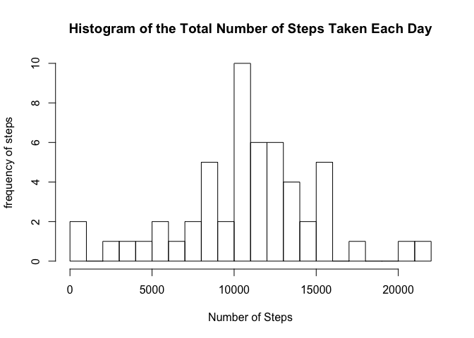
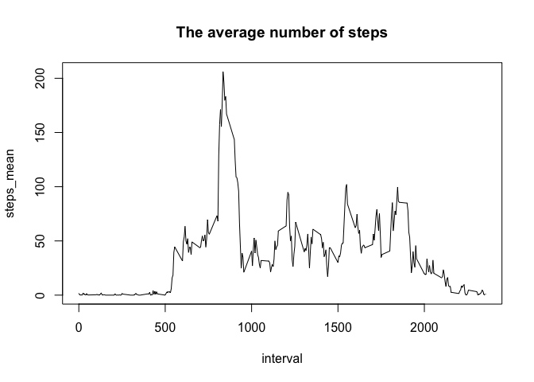
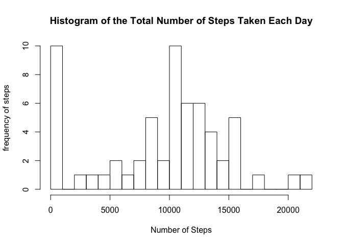
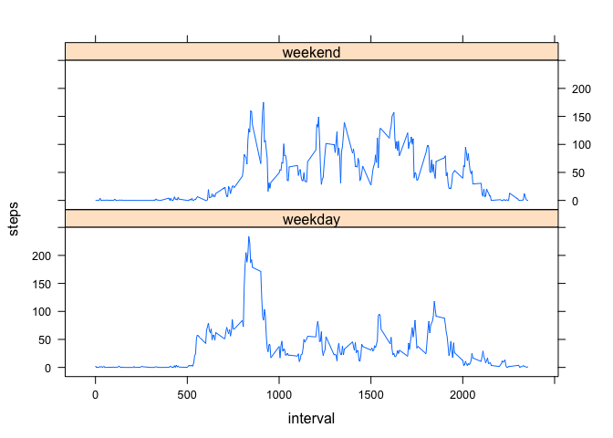

# Reproducible Research: Peer Assessment 1


## Loading and preprocessing the data

```r
library("plyr")
activity <- read.csv("./activity.csv")
activity$date <- as.Date(activity$date, "%Y-%m-%d")
```
## What is mean total number of steps taken per day?
#### Total number of steps taken per day

```r
daily_steps <- ddply(activity, .(date), summarise, steps=sum(steps, na.rm=FALSE))
```
#### Histogram of total number of steps taken each day

```r
hist(daily_steps$steps,
     breaks = 20, 
     main="Histogram of the Total Number of Steps Taken Each Day",
     ylab='frequency of steps', 
     xlab="Number of Steps")
```

 
#### Mean and Media of the total number of steps taken per day

```r
mean(daily_steps$steps, na.rm=TRUE)
```

```
## [1] 10766.19
```

```r
median(daily_steps$steps, na.rm=TRUE)
```

```
## [1] 10765
```

## What is the average daily activity pattern?
#### Time series

```r
interval_mean <- aggregate(steps ~ interval, data = activity, FUN = mean, na.rm=TRUE)
names(interval_mean) <- c("interval", "steps_mean")
plot(interval_mean, type = "l", main="The average number of steps")
```

 
#### Which 5-minute interval, on average across all the days in the dataset, contains the maximum number of steps?

```r
max_interval <- which.max(interval_mean$steps_mean)
interval_mean$interval[max_interval]
```

```
## [1] 835
```

## Inputing missing values
#### Calculate and report the total number of missing values in the dataset

```r
length(activity$steps[is.na(activity$steps)])
```

```
## [1] 2304
```

#### New dataset that is equal to the original dataset but with the missing data filled in.

```r
new_activity <- activity
na_list <- is.na(new_activity$steps)
daily_mean <- aggregate(steps ~ date, data = activity, FUN=mean, na.rm=FALSE)
names(daily_mean) <- c("date", "steps_mean")

for (i in 1:nrow(new_activity)){
        if (na_list[i]==TRUE){
                date <- new_activity$date[i]
                date <- as.Date(date, "%Y-%m-%d")
                if (is.na(daily_mean$steps_mean[date])){
                        new_activity$steps[i] <- 0
                }
                else {
                        new_activity$steps[i] <- daily_mean$steps_mean[date]
                }
        }
}
```
#### Histogram of the total number of steps taken each day 

```r
new_daily_steps <- ddply(new_activity, .(date), summarise, steps=sum(steps))
hist(new_daily_steps$steps,
     breaks = 20, 
     main="Histogram of the Total Number of Steps Taken Each Day",
     ylab='frequency of steps', 
     xlab="Number of Steps")
```

 

#### Mean & Median

```r
mean(new_daily_steps$steps)
```

```
## [1] 9354.23
```

```r
median(new_daily_steps$steps)
```

```
## [1] 10395
```


## Are there differences in activity patterns between weekdays and weekends?

```r
activity$day <- weekdays(activity$date)

# Set day_type to weekday by default
activity$day_type <- c("weekday")

# If day is Saturday or Sunday, set day_type to weekend
for (i in 1:nrow(activity)){
        if (activity$day[i] == "Saturday" || activity$day[i] == "Sunday"){
                activity$day_type[i] <- "weekend"
        }
}

stepsInt <- aggregate(steps ~ interval + day_type, data=activity, FUN=mean)
names(stepsInt) <- c("interval", "day_type", "steps")

library(lattice)
xyplot(steps ~ interval | day_type, stepsInt, type = "l", layout = c(1, 2))
```

 
